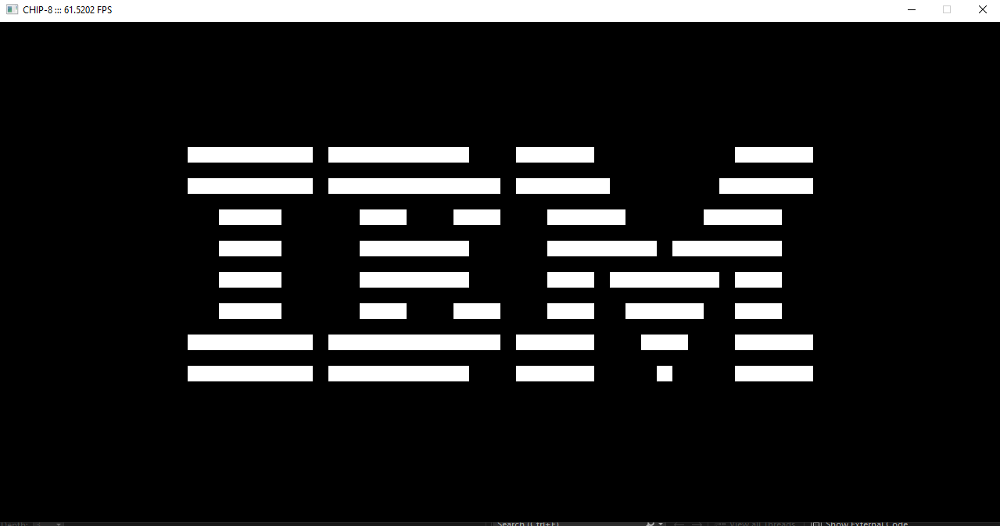

# README

This is a simple CHIP-8 Emulator based on [this article](https://tobiasvl.github.io/blog/write-a-chip-8-emulator/). It was written over a day and a half and has a couple of debug features (though they require modifying the code to activate them).

## Building
When cloning using git, make sure to use ```--recursive``` in order to properly acquire and build SDL2. The full command looks like this:
```bash
git clone --recursive https://github.com/dabusmc/Chip-8
```
### Windows
To build in Windows, open the ```scripts``` folder and run the ```win-genprojects.bat```. This will create a Visual Studio 2022 solution and set it up properly for this project. Then, open up the solution and build/run through Visual Studio. 

### Other
This project only supports Windows as that is my main development OS and there are no plans to port it to other Operating Systems.

## Running
In order to run the file, you will need a .ch8 ROM file to run. Some have been provided in the ```Chip/roms``` folder. Once you have acquired a ROM, you need to pass its full path as a command-line argument to run the solution. To do this from within Visual Studio, follow [this guide](https://condor.depaul.edu/glancast/393class/docs/helpdocs/cmdArgsInVS.html).

## Gallery


